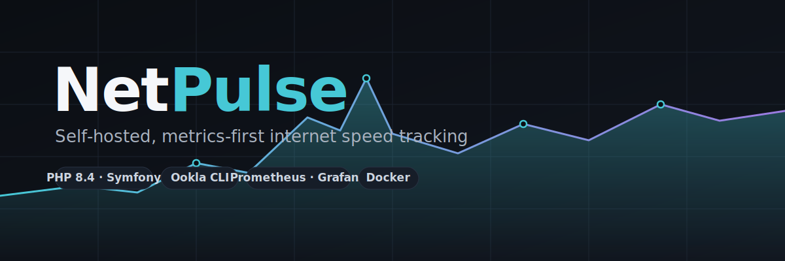
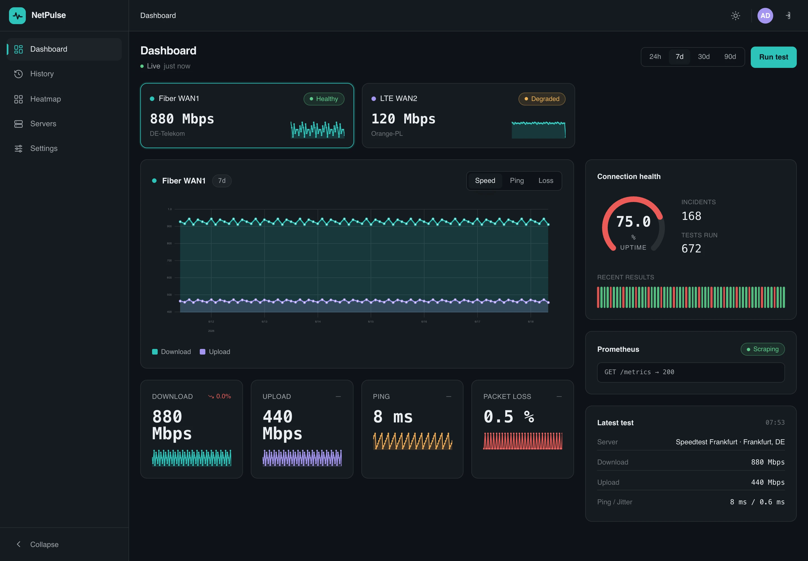
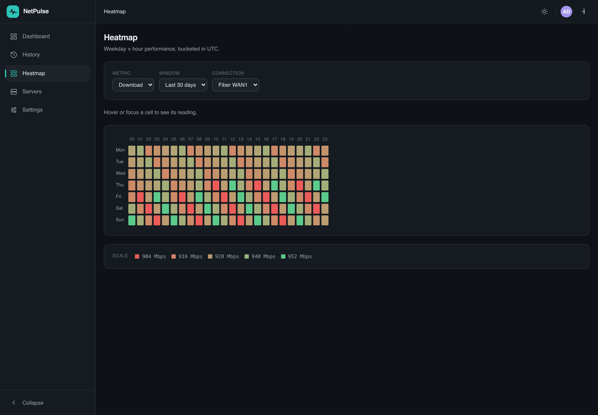
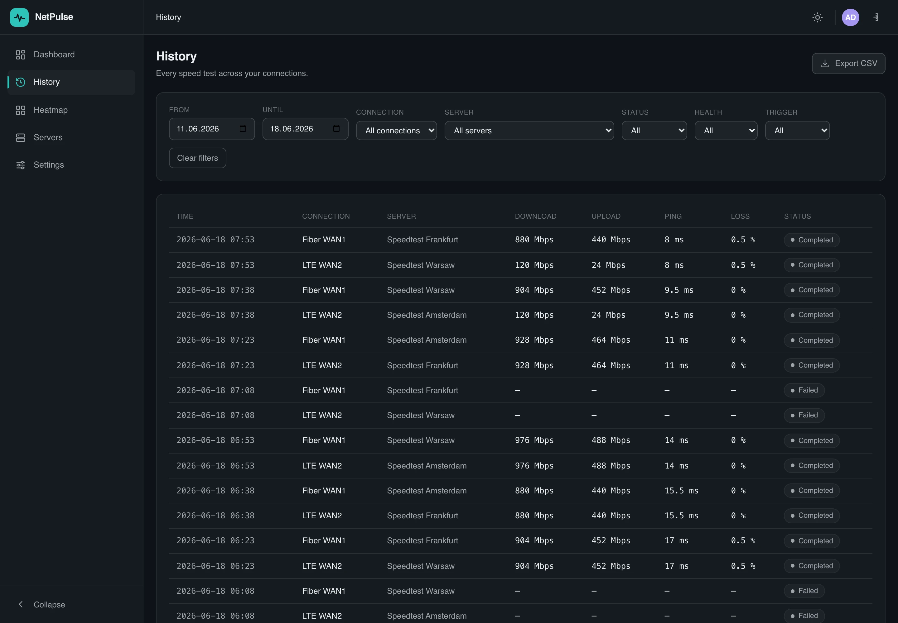
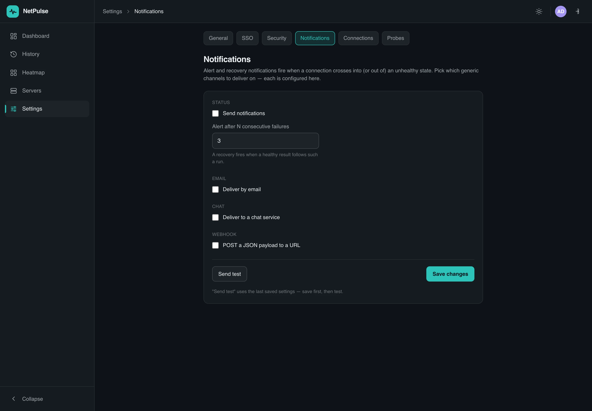
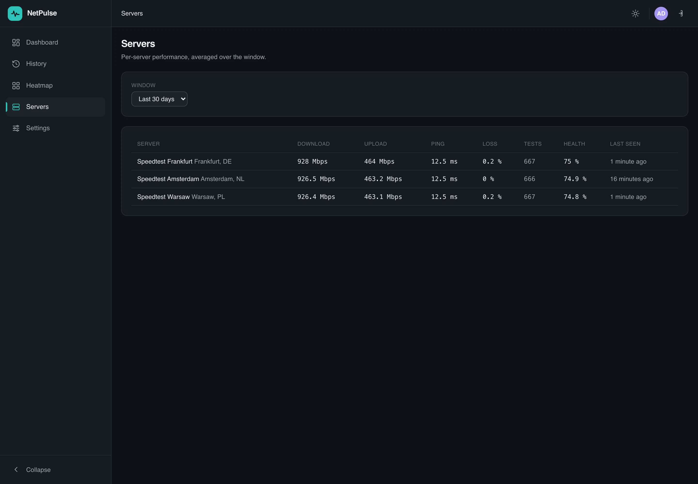
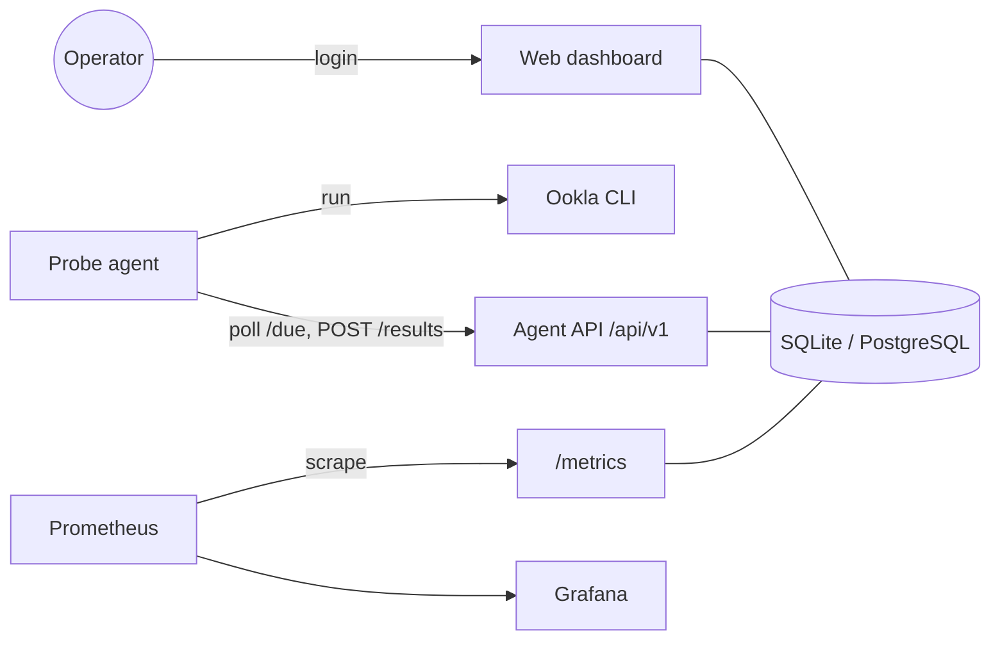

<div align="center">



# NetPulse — self-hosted internet speed tracker

**Schedule Ookla speed tests across every connection, track download / upload / ping / packet-loss
trends, get alerts, and export to Prometheus & Grafana — all on your own Docker host.**

[](https://github.com/MrHDOLEK/NetPulse/actions/workflows/php.yml)
[](https://phpstan.org/)
[](https://php.net/)
[](https://symfony.com/)
[](LICENSE)

[**Documentation**](https://mrhdolek.github.io/NetPulse/) ·
[Getting started](https://mrhdolek.github.io/NetPulse/guide/getting-started) ·
[How it works](https://mrhdolek.github.io/NetPulse/guide/how-it-works) ·
[Contributing](https://mrhdolek.github.io/NetPulse/contributing)

</div>

---

## What is NetPulse?

**NetPulse** is a self-hosted, **metrics-first internet speed tracker**. Instead of running a
one-off speed test in your browser, NetPulse continuously measures your real ISP performance over
time: it schedules [Ookla Speedtest](https://www.speedtest.net/apps/cli) runs across one or more
connections, records every result, and turns them into live charts, a searchable history, a
weekday × hour heatmap, alerts, and a **Prometheus `/metrics`** endpoint you can graph in **Grafana**.

It runs entirely on **Docker**, is **single-tenant** (one admin, your data only), and is built on
**PHP 8.4 / Symfony 7.3** with a clean Hexagonal + DDD architecture.

## Features

- 📈 **Metrics-first** — every measurement on a Prometheus `/metrics` endpoint + a bundled Grafana dashboard (optional remote-write).
- 🛰️ **Scheduled & adaptive testing** — even or cron schedules per connection, round-robin server selection, and faster retesting of a degraded link.
- 🌐 **Multi-connection** — monitor several WANs/links independently, each with its own schedule, server pool and thresholds.
- 📊 **Dashboard, history & heatmap** — live Speed / Ping / Loss charts (24h–90d), filterable history with CSV export, and a "when is it slow?" heatmap.
- 🔔 **Alerts & digests** — edge-debounced alert/recovery notifications over email, chat or webhook, plus a daily/weekly digest.
- 🔒 **Private & secure** — single admin created on first run, optional OIDC SSO and TOTP 2FA, strict CSP, token-guarded agent API.
- 🐳 **Self-hosted** — Docker Compose for the server, Prometheus, Grafana, and the probe agent. No third-party telemetry.
- 🧩 **Clean & strict** — Hexagonal + DDD enforced by deptrac, PHPStan level 10, a no-Node frontend (AssetMapper + Tailwind + Alpine + uPlot).

## Screenshots

The live dashboard — per-connection health, speed / ping / loss charts, trend tiles and sparklines:



<table>
  <tr>
    <td width="50%"></td>
    <td width="50%"></td>
  </tr>
  <tr>
    <td width="50%"></td>
    <td width="50%"></td>
  </tr>
</table>

More in the **[screenshots gallery](https://mrhdolek.github.io/NetPulse/guide/screenshots)**.

## How it works

NetPulse is **pull-based**: lightweight **probe agents** poll the server for due work, run the
Ookla CLI, and push results back. The server decides *when* a connection is due (there is **no
server-side cron**) and fans each result out to the dashboard, history, metrics and notifications.



Read the full walkthrough — with the agent loop, the due-decision flow, and the architecture — in
the [documentation](https://mrhdolek.github.io/NetPulse/guide/how-it-works).

## Quick start

> **Prerequisites:** Docker + Docker Compose, and git.

```bash
git clone https://github.com/MrHDOLEK/NetPulse.git
cd NetPulse

make install          # build the image, start containers, composer install
make start            # docker compose up -d

# Build the database from migrations
docker compose exec -T app composer migrate
```

Open **http://localhost:8080** — every page redirects to **`/setup`** until you create the first
admin (email + password, min 12 chars). Then add a probe and a connection, and start the agent:

```bash
# 1. Create a probe (the token is shown once)
docker compose exec -T app php bin/console app:probe:create "Office probe"

# 2. Create a connection for it (288 tests/day, round-robin over 2 servers)
docker compose exec -T app php bin/console app:connection:create "WAN" \
  --probe=<PROBE_ID> --schedule-mode=even --tests-per-day=288 --server-pool=11111,22222

# 3. Run the agent (it polls for due work and runs speedtests)
PROBE_ID=<PROBE_ID> PROBE_TOKEN=<PROBE_TOKEN> docker compose --profile agent up agent
```

Measurements now flow into the dashboard at `http://localhost:8080`, the REST API docs at
`http://localhost:8080/api/doc`, and the Prometheus `/metrics` endpoint.

👉 Full instructions: **[Getting started](https://mrhdolek.github.io/NetPulse/guide/getting-started)**.

## Self-hosting (single container)

For production there's a single self-contained image — **nginx + php-fpm in one container** (managed
by supervisord), with the app code, dependencies and compiled assets all baked in. The only state is
one `var/` volume. No bind mounts, no separate web server.

The image is published to the **GitHub Container Registry** (`ghcr.io/mrhdolek/netpulse`) on every
push to `main`. Pull and run it:

```bash
# a stable random secret (rotating it logs everyone out — keep it)
export APP_SECRET=$(openssl rand -hex 16)

docker run -d --name netpulse \
  -p 8080:8080 \
  -e APP_SECRET="$APP_SECRET" \
  -v netpulse_var:/var/www/var \
  ghcr.io/mrhdolek/netpulse:latest
```

…or with the bundled compose file (same image, plus a named volume):

```bash
export APP_SECRET=$(openssl rand -hex 16)
docker compose -f compose.prod.yml pull
docker compose -f compose.prod.yml up -d
```

Either way it runs database migrations on boot and serves the dashboard on
**http://localhost:8080** (create the first admin at `/setup`). It defaults to SQLite in the volume;
point `DATABASE_URL` at PostgreSQL for larger installs.

Prefer to build from source? `docker compose -f compose.prod.yml up -d --build`, or
`docker build -f .docker/php/Dockerfile --target prod -t netpulse .`.

### Run the probe agent on the same host

`compose.prod.yml` also ships an **`agent`** service (the same image, behind the `agent` profile), so
a probe can run **alongside the server on one instance** — it reads everything it needs from env. Once
the server is up, create a probe and feed its identity to the agent:

```bash
# create a probe inside the running server (token shown once)
docker compose -f compose.prod.yml exec netpulse php bin/console app:probe:create "local"

# put PROBE_ID + PROBE_TOKEN in your .env, then start the agent:
docker compose -f compose.prod.yml --profile agent up -d
```

The agent polls the server at `http://netpulse:8080` over the compose network and runs `speedtest`
for each due task. Knobs (all env): `PROBE_ID`, `PROBE_TOKEN`, `AGENT_POLL_INTERVAL`, `OOKLA_BINARY`.
To start it together with the stack every time, set `COMPOSE_PROFILES=agent` in your `.env`.

The agent has a **healthcheck** (the server's per-probe liveness endpoint, which reports `503` if the
probe stops polling) and an **`autoheal`** sidecar (also under the `agent` profile) that restarts the
agent container when it goes unhealthy.

## Documentation

The complete docs live at **[mrhdolek.github.io/NetPulse](https://mrhdolek.github.io/NetPulse/)**:

| Page | What's in it |
| --- | --- |
| [Introduction](https://mrhdolek.github.io/NetPulse/guide/introduction) | What NetPulse is and the core concepts. |
| [Getting started](https://mrhdolek.github.io/NetPulse/guide/getting-started) | Install and first-run walkthrough. |
| [How it works](https://mrhdolek.github.io/NetPulse/guide/how-it-works) | The agent loop, scheduling, and data flow (with diagrams). |
| [Configuration](https://mrhdolek.github.io/NetPulse/guide/configuration) | Every environment variable and option. |
| [Architecture](https://mrhdolek.github.io/NetPulse/guide/architecture) | Hexagonal + DDD layers and modules. |
| [Contributing](https://mrhdolek.github.io/NetPulse/contributing) | Dev setup, the quality gate, and conventions. |

The docs site is built with VitePress and lives in [`docs/`](docs/). To run it locally:

```bash
cd docs && npm install && npm run docs:dev
```

## Tech stack

PHP 8.4 · Symfony 7.3 · Doctrine ORM (XML mapping, migrations-only) · SQLite / PostgreSQL ·
Ookla Speedtest CLI · Prometheus + Grafana · Twig + Tailwind 3 + Alpine.js (CSP build) + uPlot via
AssetMapper (no Node) · Hexagonal + DDD (deptrac) · PHPStan level 10 · PHPUnit + Behat.

## Contributing

Contributions are welcome! Please read the **[contributing guide](https://mrhdolek.github.io/NetPulse/contributing)**,
keep the [quality gate](https://mrhdolek.github.io/NetPulse/contributing#the-quality-gate) green, and
start PR titles with `- ` (the CI-enforced convention, e.g. `- Add X`). Found a bug or have
an idea? [Open an issue](https://github.com/MrHDOLEK/NetPulse/issues/new/choose).

## License

Released under the [MIT License](LICENSE).
