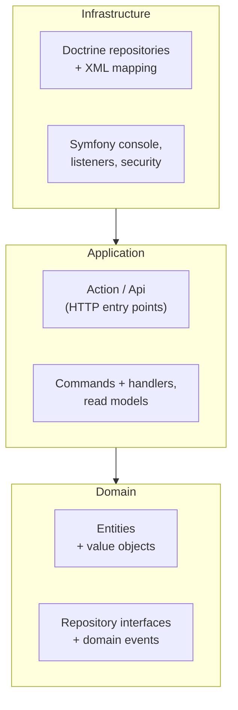
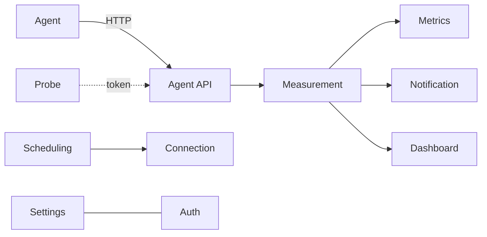

# Architecture

NetPulse is a **PHP 8.5 / Symfony 8.1** application built with **Hexagonal architecture
(Ports & Adapters) + Domain-Driven Design**. The layering is not just a convention — it is
enforced in CI by [Deptrac](https://github.com/deptrac/deptrac), with **0 violations**
required, and the whole codebase is linted and statically analysed by [Mago](https://mago.carthage.software/).

## Layers and the dependency rule

Code is split into three layers, and dependencies only ever point **inward**:

- **Domain** — entities, value objects, domain events and **repository interfaces**. No
  framework imports whatsoever.
- **Application** — use cases as CQRS commands/queries and handlers, read-model interfaces, and
  the thin HTTP **Actions**. Depends on Domain (and, for the Actions only, the framework).
- **Infrastructure** — Symfony, Doctrine and external services that **implement** the
  Domain/Application ports.

`Infrastructure → Application → Domain`, never the reverse. The Domain must not import
Application or Infrastructure, and the core Application must not import Infrastructure. The one
deliberate exception is the HTTP `*Action` / `*Api` classes: they are the composition/delivery
point, so they live in `Application/{Action,Api}` and may wire Infrastructure. Modules never
depend on each other directly — only through `Shared` interfaces or Domain events.

## Modules

The code is organised by **module**, each with the same `Domain / Application / Infrastructure`
split under `src/<Module>/`. `Shared` is the common kernel.

| Module | Responsibility |
| --- | --- |
| **Agent** | The probe agent process: poll, run the Ookla CLI, push results. |
| **Auth** | Single admin account, roles, OIDC SSO, TOTP 2FA. |
| **Connection** | Monitored links — schedule, server pool, thresholds. |
| **Dashboard** | Read models for the dashboard, history, heatmap and series charts. |
| **Dev** | Developer tooling (seeding). |
| **Measurement** | The measurement entity and recording use case. |
| **Metrics** | The Prometheus `/metrics` endpoint and remote-write. |
| **Notification** | Alerts, recoveries and the periodic digest. |
| **Probe** | Probe identities and their Bearer tokens. |
| **Scheduling** | The due-work calculator, cron evaluation and run state. |
| **Settings** | In-app settings (general, SSO) persisted in the database. |
| **Shared** | Contracts, shared application services, Symfony plumbing. |

## HTTP entry points

Every HTTP route is a thin, single-purpose **`*Action`** class that **parses the request →
dispatches a command/query → formats the response**. No business rules live in an Action;
mutations always go through an Application command + handler on the command bus.

- Web pages live in `src/<Module>/Application/Action/` (no prefix).
- Agent endpoints live in `src/<Module>/Application/Api/` and are imported under the `/api`
  prefix.

Request bodies are parsed by **argument value resolvers** into typed DTOs (never by reading the
raw request content in the Action).

## Persistence

- **Entities** live in `Domain/Entity/` and carry **no Doctrine attributes**.
- **Mapping** is XML in `Infrastructure/Doctrine/Mapping/` (`Entity.<Name>.orm.xml`).
- **Value objects** persist through custom **DBAL types**.
- The schema is **migrations-only** — never `doctrine:schema:update`. Migrations stay portable
  (SQLite for dev/test, PostgreSQL in production).

## What's enforced

- **Deptrac** — the layer/module boundaries above, 0 violations.
- **Mago** — linter, formatter & static analyzer (replaced PHPStan + php-cs-fixer); strict types everywhere (`declare(strict_types=1)`). `mago analyze` (scoped to `src` + `config`) must be clean — no baseline; in CI its findings go to GitHub Code scanning.
- **PHPUnit** — unit and integration suites. (Behat is parked until its ecosystem supports Symfony 8.)

CI (`Test&lint PHP codebase`) runs the same gate on every push and pull request.

## Frontend (no Node)

The operator UI is server-rendered **Twig** with **Tailwind CSS 3** (via the
symfonycasts/tailwind-bundle standalone binary), a sprinkle of **Alpine.js** (the strict-CSP
`@alpinejs/csp` build), and **uPlot** charts. Assets are served through Symfony **AssetMapper**
and an import map — there is **no Vite, no npm and no `package.json`** for the application
itself. (This documentation site is the one exception, and it lives entirely under `docs/`.)

Ready to dig in? Head to [Contributing](/contributing).
