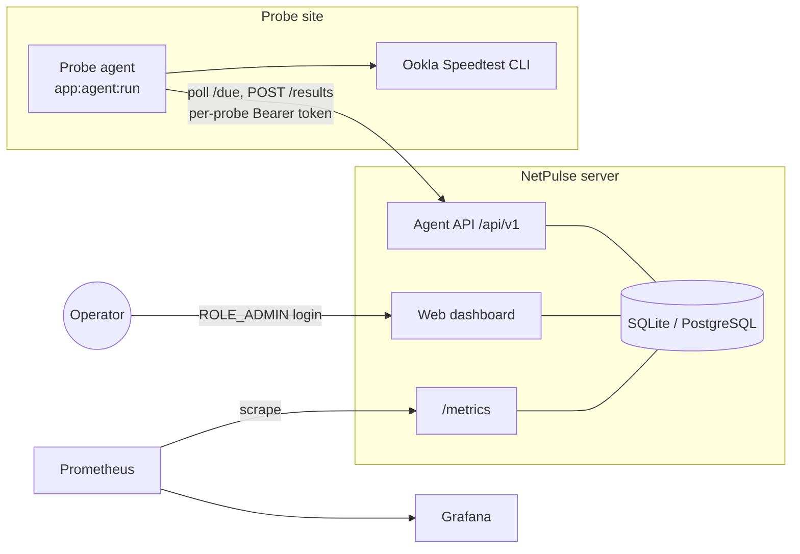
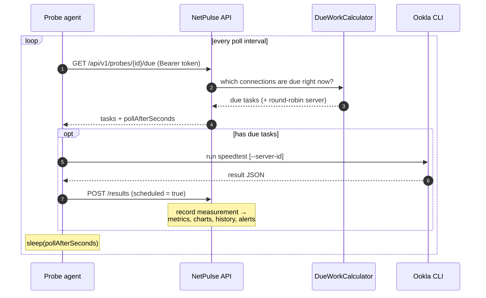
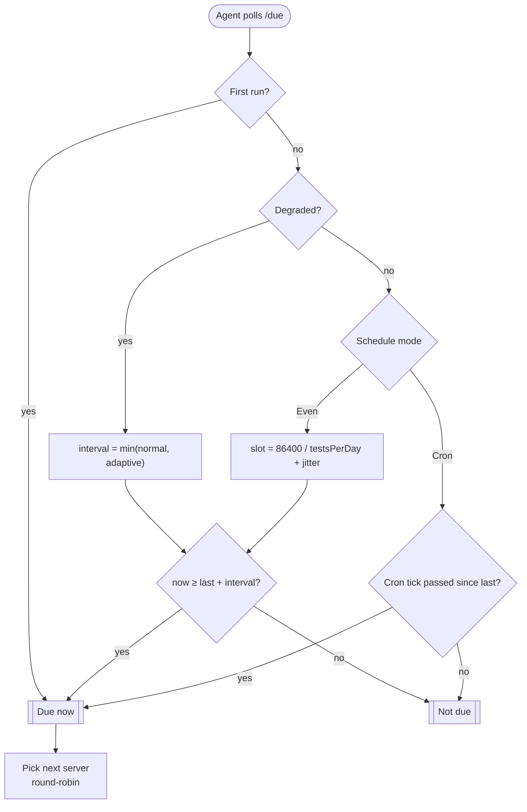

# How it works

NetPulse has two moving parts: a **server** (the web dashboard, the agent API, and the
Prometheus `/metrics` endpoint) and one or more **probe agents** that actually run the
speedtests. The agents do the measuring; the server decides *when* a measurement is due and
turns the results into charts, history, metrics and alerts.

The most important thing to understand up front: **the server has no background scheduler or
cron**. "Due-ness" is computed *on demand* every time an agent asks for work. The system is
entirely **pull-based** — agents poll, the server answers.

## The big picture



The agent runs the **same codebase** as the server but in a single-purpose mode. It ships as a
dedicated Docker service (`agent`) behind the `agent` compose profile, so it never starts with
the default `docker compose up`.

## The agent loop

Each cycle the agent fetches due work, runs a speedtest for every due task, and pushes the
result back. Then it sleeps and repeats.



Resilience is the whole point of the loop: a failed speedtest still produces a (failed-shaped)
result that is pushed, and a whole-cycle failure (server unreachable, `/due` failed) is logged
and retried after the fallback interval — one bad tick never crashes the daemon.

::: tip Poll interval ≠ test frequency
`AGENT_POLL_INTERVAL` only controls **how often the agent checks** for work. How often a
connection is actually *tested* is set by its **schedule** (see below). With `testsPerDay = 24`
and a 60-second poll, the agent asks every minute but only runs a test about once an hour.
:::

## How "due" is decided

When an agent polls, the server walks the probe's enabled connections and asks the pure,
stateless `DueWorkCalculator` whether each one is due *now*, given its last measurement.



- **First run** — a connection with no prior measurement is always due immediately.
- **Even mode** — one test roughly every `86400 / testsPerDay` seconds, plus a *deterministic
  per-connection jitter* so connections don't all fire at the same instant.
- **Cron mode** — due whenever one of the connection's cron expressions has ticked since the
  last measurement.
- **Adaptive** — when a connection is judged **degraded** from its recent health history, the
  effective interval tightens to `min(normal, adaptiveInterval)`, so a struggling link is
  retested sooner. Because the server is already rotating servers round-robin, that densified
  retest lands on a *different* Ookla server for free.
- **Run now** — the dashboard's **Run test** button inserts a one-shot "due now" marker that
  the scheduler consumes on the agent's next poll (and only completes while an agent is
  running).

The interval is always measured from the **last measurement's completion time**, not from when
the agent started.

## From measurement to insight

A pushed result is recorded once and then fans out:

- **Dashboard** (`/`) — health badge, live speed/ping/loss charts (24h / 7d / 30d / 90d), stat
  tiles with trend, and per-connection sparklines.
- **History** (`/history`) — every measurement, filterable by date, connection, server and
  status, sortable, with full result detail and CSV export.
- **Heatmap** (`/heatmap`) — a weekday × hour-of-day matrix that answers *"when is this
  connection consistently slow or unhealthy?"*
- **`/metrics`** — Prometheus scrapes the latest values; the bundled Grafana dashboard graphs
  them, and an optional remote-write ships them off-box.
- **Notifications** — edge-debounced alert/recovery messages and a periodic digest.

## What you actually run

To get scheduled background testing, you only need to run **one extra process: the agent**.

```bash
PROBE_ID=<id> PROBE_TOKEN=<token> docker compose --profile agent up agent
```

There is **nothing to schedule on the server** — no cron, no worker — because due-ness is
computed inline in the `/due` request. See [Getting started](./getting-started) to create a
probe and a connection, and [Configuration](./configuration) for the agent's environment.
